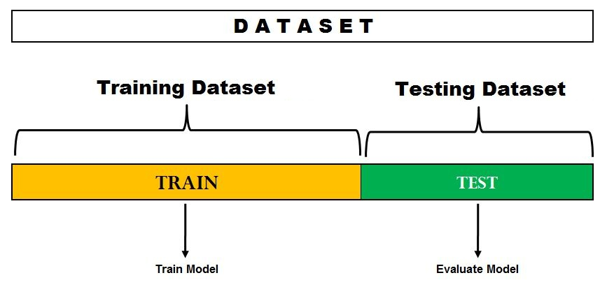

## Introduction

Statistics has been the center of the data revolution. Data science is majorly based on Statistics and Mathematics. Regularization, errors and the entropy calculations are all based on *Maths* and *Statistics* in some or the other way. Data is being leveraged in many ways in the recent times. It has been used to forecast just about everything. Data is used to track user behavior and scale [3]. Data is being used in agriculture to try and predict the need and if the supply is going to be enough to feed people. It is also used in marketing to target ads for an increase in the attraction rates as it is very obvious that if a user is showed deals on things that one is searching for one will try and get to the place where the deals are.

Google is an ad selling company that uses our data in ways that we cannot fathom and minting money fast and on road of becoming a very humongous conglomerate. Stock markets are also indices that are highly volatile and are being tamed by data. There are multiple ways in which stock market's movement is being predicted, some use market sentiment attached to the stock to predict movement, some use hybrid methods. This just goes to show how data is being used and is useful in all sections of the industry. Data has assumed a pivotal role in the industry, mostly all companies are trying to gather as much data possible for business insights that can help them coddle their bottom line and gather as much profit as possible.

Time series is a type of data in which the records are indexed in time order. This is generated by recording data in set intervals [1]. This type of data helps us get a historical pattern where we can have the future predicted based on how the things acted in the past. This give use a pattern on which we can further predict.This pattern generation is historical in nature as we have a lot of context from which we can infer what can and will happen during similar situations in the future. Time series is benefited from as much data as we have, the more the data that we have with us the more it is going to be able to predict.

## Components of Time Series Data

Time series data is a volatile type of data that generates patterns over a period of time. There are some basic characters of a time series data that can help us understand how to tackle the data and generate usable forecasts from it. The characters are the starting points which help us make informed decisions with regards to the type of algorithm that we use to generate usable insights.

> **Level**
>
> This is the average values of the data series over a specified period of time [4]

> **Trend**
>
> This is used to describe the direction of the time series propogation
>
> If the time series is increasing in a particular period of time, it is said to be in \> a *positive* trend On the other hand if the time series in decreasing in a given period of time it is said to be having a *negative* trend

> **Seasonality**
>
> Time series are usually indexed with time, as there is a seasonality in the time series that is present over the period of time which repeats itself over a period of time is called seasonality [4]

> **Cyclic**
>
> This is also used to describe seasonality in data but here the only difference is that that instead of *periodical* repetion it repeats *aperiodically*.

> **Noise**
>
> This is the random fluctuation in data that affect the prediction as they are useless \> in nature but nonetheless they affect the outcome, or rather they pollute the outcome \> of the forecast.

## ARIMA (Auto Regressive Integrated Moving Average)

This model is a better extension of the ARMA model which is basically a simple merger of two models that are Auto Regressive Model (AR) and Moving Average (MA).

### Assumptions

There are 2 basic assumptions that are made when we want to forecast using time series models.

1.  Stationary Data

This is a type of data in which the mean, variance and the covariance is said to be constant. This is an ideal scenario. In the real world we hardly find data that is such because of the noise and also because in real world things are never found to be constant in any sense.

Let's take a look at previously made graphs, one of which is stationary and the other that is not.

![Non Stationary Time Series Example [5]](non_stationary.png){width="50%"}

*Figure 1* is a simple representation of the data that we get in the real world, it clearly shows a trend which means that it is not a stationary time series.

![Stationary Time Series Example [5]](stationary.png){width="50%"}

We then standardize the data and bring everything between -1 and 1, this helps us make the data stationary as shown in the *figure 2*.

We do hypothesis testing to check if the data is stationary or not.

1.  Kwiatkowski-Phillips-Schmidt-Shin (KPSS) Test

2.  Augmented Dickey-Fuller (ADF) Test

3.  Auto Correlation

Auto in this context means self, this shows the similarity between the lagged and the given time series. This helps us understand the relationship between the current and the past values of the variable. This helps us understand the influence of the variable on itself.

### Auto Regressive (AR) Models

This kind of models use linear regression to predict future values over a period of time using one or two values from the past. [4]

#### Mathematical Formula Used
$$ y_t = c + \phi_1 + y_{t-1} + \epsilon_t  $$

Where, $y_t$ is the values at time step t, c is a constant, $\phi_1$ is a constant, and $\epsilon_t$ is a white noise error term.
 
This can be further expanded as :

$$ y_t = c + \phi_1 + y_{t-1} + \phi_2y_{t-2} ... + \phi_py_{t-p} + \epsilon_t $$


Whose short representation is :

$$ y_t = c + \sum_{i=1}^{p}\phi_iy_{t-i} $$

### Moving Average (MA) Models

These models forecast future values using the errors of the past forecast in a regression like model.

#### Mathematical Formula Used

$$ y_t = c + \theta_1\epsilon_{t-1} $$

Where : $y_t$ is the value at time step t, c is a constant, $\theta_1$ is a coefficient, and $\epsilon_{t-1}$ is a previous white noise term.

This can be represented as :

$$ y_t = c + \sum_{j=1}^q \theta_j\epsilon_{t-j} $$

### ARMA Model

This is a model that can be represented as a simple merger between previously described AR and MA models.

This can be represented as : AR + MA which comes out to be 

$$ y_t = c + \sum_{i=1}^{p} \phi_i y_{t-1} + \sum_{j=1}^{q} \theta_j\epsilon_{t-1} $$

Where : p and q are orders of AR and MA models.

The ARIMA model cannot work on non-stationary time series, the process of conversion to stationary is said to be Integration. Here we take the difference until the series is stationary.

This gives out the ARIMA relation to be : ARIMA(p,d,q)

Where : p , q are orders of AR and MA models respectively and d is the number of differences to be conducted.

## Example using ARIMA

```{r include=FALSE, echo=FALSE}
  library(ggplot2)
  require(dplyr)
  require(tidyr)
  require(forecast)
  # Including all the libraries
  
  DFF <- read.csv("./DFF.csv") #Reading data.
```

### Data Description

Variable | Type | Description
---------|------|------------
Date     | DATE | This is the date at which the data was recorded.
DFF      | CONTINUOUS | This is the federal fund relative rate of interest.

```{r out.width="50%", fig.align='center', fig.cap="Federal Reserve Interest Rates", echo=FALSE, include=TRUE}
  
  ggplot(data = DFF, aes(x=DATE, y=DFF, group=1))+
  geom_line()+
  theme(axis.ticks.x=element_blank(),axis.text.x=element_blank())

```

```{r echo=FALSE, include=FALSE}

  split <- round(nrow(DFF)*0.75, digits = 0)
  train_df <- DFF[1:split,]
  test_df <- DFF[nrow(DFF)-split:nrow(DFF),]
  #Data split
  
```

{width="50%"}

We split the data into a train and test split for cross-validation purposes.

```{r include=FALSE, echo=TRUE}

  dat_ts <- ts(train_df[, 2], start = c(2017, 1), end = c(2022, 12), frequency = 12) #Preping Data
  arima_model <- auto.arima(dat_ts)
  summary(arima_model) #Summary of the Model
  
```


```{r}
    
  arima_forecast = forecast::forecast(arima_model, h=12)

  arima_forecast #This is the forecast for the next one year of Federal Reserve Rates
```


## Final Code Chunk

```{r ref.label=knitr::all_labels(), echo=TRUE, eval=FALSE}
```

## References

1.  Wikipedia Contributors. Time series Internet. Wikipedia. Wikimedia Foundation; 2019. Available from: <https://en.wikipedia.org/wiki/Time_series>
2.  Liu H, Tian H, Li Y. Comparison of two new ARIMA-ANN and ARIMA-Kalman hybrid methods for wind speed prediction. Applied Energy. 2012 Oct;98:415--24.
3.  Saxena A. Scaling the Hotstar Platform for 50M Internet. Medium. 2019. Available from: <https://blog.hotstar.com/scaling-the-hotstar-platform-for-50m-a7f96a019add>
4.  Ariton L. A Thorough Introduction To ARIMA Models Internet. Medium. 2021. Available from: <https://medium.com/analytics-vidhya/a-thorough-introduction-to-arima-models-987a24e9ff71>
5.  Stationarity in Time Series Analysis Explained using Python Internet. Quantitative Finance & Algo Trading Blog by QuantInsti. 2021. Available from: <https://blog.quantinsti.com/stationarity/>
6.  May 02 AD-G /, InfluxDB 2019 /, Community, Developer. Autocorrelation in Time Series Data \| What is Autocorrelation? Internet. InfluxData. 2022 [cited 2022 Jun 2]. Available from: <https://www.influxdata.com/blog/autocorrelation-in-time-series-data>
7. Federal Reserve Bank of St. Louis. FRED [Internet]. Stlouisfed.org. Federal Reserve Bank of St. Louis; 2018. Available from: https://fred.stlouisfed.org/
8. Time Series Forecasting Using R | Pluralsight [Internet]. www.pluralsight.com. Available from: https://www.pluralsight.com/guides/time-series-forecasting-using-r